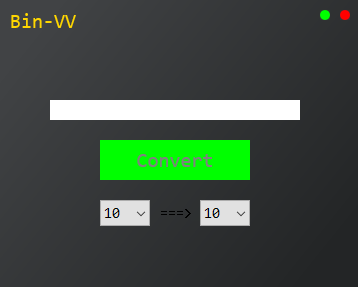
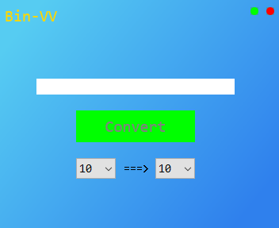
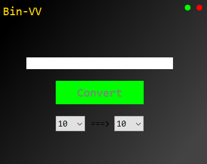

# Themes

Setuping another themes
--

---

  __1. Create file ```St.txt```__
  
  __2. input this text ```Theme = [Name of theme]```  in ```St.txt```__
  
---
## Themes names:
    
 Black
 ---


 Skyes 
 ---


 
 Deep_Space
 ---

